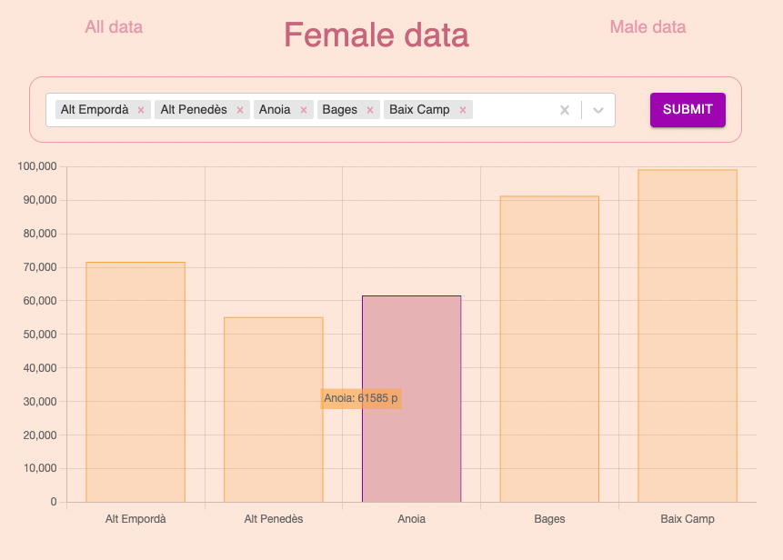

# ChartJS {


<p align="center">
  
</p>

## Table of Contents

1. [Technologies](#technologies)
1. [Libraries](#libraries)
1. [About](#about)
1. [Set Up](#set-up)
1. [Commands Availables](#commands-availables)
1. [Project tree](#project-tree)
1. [Honorable mentions](#project-tree)

## Technologies

- [NodeJS](https://nodejs.org/)
- [React](https://es.reactjs.org/)
- [Nextjs](https://nextjs.org/)
- [Typescript](https://www.typescriptlang.org/)

## Libraries

- [Chartjs](https://www.chartjs.org/)
- [Chartjs-plugin-datalabels](https://chartjs-plugin-datalabels.netlify.app/)
- [Eslint](https://eslint.org/)
- [Mui](https://mui.com/)
- [Styled-components](https://styled-components.com/)
- [React-hook-form](https://react-hook-form.com/)

## About

A small project that shows population data by region and gender in Catalonia.

## Set Up

To download and start the project you need to run the following commands:

```bash
# Clone the project into your local pc
git clone https://github.com/amargopastor/chartJS.git

# Move into it
cd chartJS

# Install all the necessary dependencies (you can check them in the package.json)
yarn install
```

## Commands Availables

Once you've set up the project you're ready to run develop app. Here there are different options:

```bash
# Start the project in dev mode (runs typescript files)
yarn run dev
```

## Project tree

```
chartJS
├─ .gitignore
├─ LICENSE
├─ README.md
├─ components
│  ├─ CountiesChart.tsx
│  ├─ CountiesForm.tsx
│  ├─ Menu.tsx
│  ├─ Option.tsx
│  └─ SubmitButton.tsx
├─ lib
│  ├─ api.ts
│  └─ useContext.tsx
├─ next-env.d.ts
├─ next.config.js
├─ package.json
├─ pages
│  ├─ _app.tsx
│  ├─ female.tsx
│  ├─ index.tsx
│  └─ male.tsx
├─ public
│  └─ readme_img.png
├─ style
│  └─ theme.congif.ts
├─ tsconfig.json
├─ types
│  ├─ countie.d.ts
│  └─ dataContext.d.ts
├─ utils
│  └─ location.pathname.ts
└─ yarn.lock

```

## Honorable mentions

🍍

**[⬆ back to top](#table-of-contents)**
